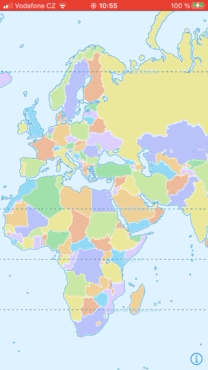
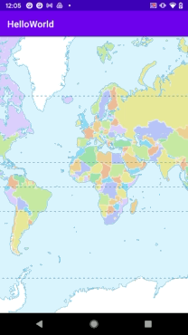

# MapLibre Hello World

MapLibre HelloWorld examples

## ios

The code to initialize map is in [ios/HelloWorld/HelloWorld/ViewController.swift](ios/HelloWorld/HelloWorld/ViewController.swift)

## Android

The code to initialize map is in [android/app/src/main/java/com/maptiler/helloworld/MainActivity.kt](android/app/src/main/java/com/maptiler/helloworld/MainActivity.kt)

